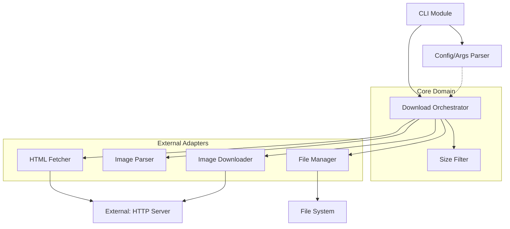
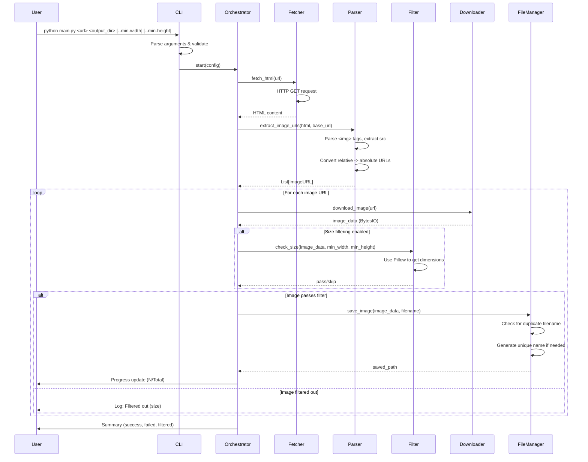
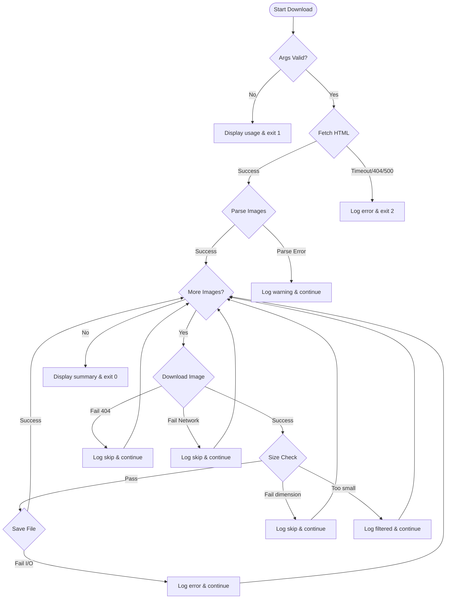

# Design Document

## Overview
本機能は、指定されたWebページから全ての画像を自動的にダウンロードするPython 3.11 CLIアプリケーションです。ユーザーはURLと保存先フォルダを指定することで、ページ内の画像を重複しない名前で保存できます。オプションで最小画像サイズを指定して小さな画像（サムネイル、アイコン等）を除外できます。

**Users**: 開発者、データサイエンティスト、コンテンツ収集者が、Webページから画像を一括収集する際に使用します。

**Impact**: 現在は手動での画像保存や個別スクリプト作成が必要ですが、本ツールによりコマンド1つで自動化されます。

### Goals
- Python 3.11 venv環境で動作する隔離された実行環境を提供
- 指定URLのページから全画像を検出してダウンロード
- ファイル名の重複を自動的に回避（連番サフィックス）
- オプションで最小画像サイズによるフィルタリング機能
- 明確なエラーメッセージとダウンロード進捗表示

### Non-Goals
- JavaScript動的生成画像の取得（静的HTML解析のみ）
- 認証が必要なページへのアクセス（将来の拡張として検討）
- 画像の形式変換や編集機能
- 並列/非同期ダウンロード（順次処理のみ）

## Architecture

### Architecture Pattern & Boundary Map



**Architecture Integration**:
- **Selected pattern**: Modular CLI with Orchestrator pattern
  - 理由: 機能が明確に分離され、各モジュールが単一責任を持つ。テストとメンテナンスが容易。
- **Domain/feature boundaries**:
  - **Core Domain**: ビジネスロジック（フィルタリング、オーケストレーション）
  - **External Adapters**: 外部システムとのI/O（HTTP、ファイルシステム、HTML解析）
- **Existing patterns preserved**: N/A（新規プロジェクト）
- **New components rationale**:
  - CLI Module: エントリーポイント、引数検証
  - Orchestrator: 全体のワークフローを調整、各モジュールを連携
  - 各Adapter: 外部システムとの境界を明確化、モックしやすい設計
- **Steering compliance**: 記述型プログラミング、型安全性、関心の分離

### Technology Stack

| Layer | Choice / Version | Role in Feature | Notes |
|-------|------------------|-----------------|-------|
| CLI | Python 3.11 + argparse (stdlib) | コマンドライン引数の解析と検証 | 型ヒントとdataclassで型安全性を強化 |
| HTTP Client | requests>=2.31.0 | URLからHTMLと画像をダウンロード | タイムアウト、エラーハンドリング標準対応 |
| HTML Parser | beautifulsoup4>=4.12.0 + lxml>=5.0.0 | HTMLから画像URLを抽出 | lxmlパーサーで高速化、標準的なスタック |
| Image Processing | Pillow>=10.0.0 | 画像寸法の取得とフォーマット検証 | Python標準の画像ライブラリ |
| Runtime | Python 3.11 venv | 隔離された依存関係管理 | requirements.txt で再現性を保証 |

技術選定の詳細な理由とトレードオフは`research.md`の「Design Decisions」セクションを参照。

## System Flows

### Main Download Flow



**Key decisions**:
- 順次処理: シンプルで予測可能、エラーハンドリングが容易（並列化は将来の拡張）
- メモリ内処理: 画像をディスクに保存する前にメモリでサイズチェック
- 失敗継続: 1つの画像DL失敗でも残りは続行

### Error Handling Flow



## Requirements Traceability

| Requirement | Summary | Components | Interfaces | Flows |
|-------------|---------|------------|------------|-------|
| 1.1, 1.2, 1.3, 1.4 | venv環境セットアップ | README, requirements.txt | - | - |
| 2.1, 2.2, 2.3, 2.4, 2.5 | URL入力とページ取得 | CLI Module, HTML Fetcher | CLIConfig, fetch_html() | Main Download |
| 3.1, 3.2, 3.3, 3.4, 3.5, 3.6 | 画像検出と抽出 | Image Parser | extract_image_urls() | Main Download |
| 4.1, 4.2, 4.3, 4.4 | 保存先フォルダ指定 | CLI Module, File Manager | CLIConfig, save_image() | Main Download |
| 5.1, 5.2, 5.3, 5.4, 5.5 | 画像ダウンロードと保存 | Image Downloader, File Manager | download_image(), save_image() | Main Download |
| 6.1, 6.2, 6.3, 6.4, 6.5 | ファイル名重複回避 | File Manager | generate_unique_filename() | Main Download |
| 7.1, 7.2, 7.3, 7.4, 7.5 | エラーハンドリング | 全モジュール | - | Error Handling |
| 8.1, 8.2, 8.3, 8.4, 8.5 | CLI インターフェース | CLI Module | parse_arguments() | - |
| 9.1, 9.2, 9.3, 9.4, 9.5, 9.6, 9.7 | 画像サイズフィルタリング | Size Filter | check_image_size() | Main Download |

## Components and Interfaces

### Component Summary

| Component | Domain/Layer | Intent | Req Coverage | Key Dependencies (P0/P1) | Contracts |
|-----------|--------------|--------|--------------|--------------------------|-----------|
| CLI Module | Entry Point | 引数解析とアプリケーション起動 | 2.1, 4.1, 8.1-8.5 | argparse (P0), Orchestrator (P0) | Service |
| Download Orchestrator | Core Domain | ダウンロードワークフローの調整 | 5.4, 7.4 | Fetcher (P0), Parser (P0), Downloader (P0), Filter (P1), FileManager (P0) | Service |
| HTML Fetcher | External Adapter | URLからHTMLコンテンツを取得 | 2.2, 2.3, 2.4, 2.5 | requests (P0) | Service |
| Image Parser | External Adapter | HTMLから画像URLを抽出 | 3.1-3.6 | beautifulsoup4 (P0), urllib.parse (P0) | Service |
| Size Filter | Core Domain | 画像寸法によるフィルタリング | 9.1-9.7 | Pillow (P0) | Service |
| Image Downloader | External Adapter | 画像データのダウンロード | 5.1, 5.2, 5.3 | requests (P0) | Service |
| File Manager | External Adapter | ファイル保存と重複回避 | 4.2, 4.3, 5.2, 6.1-6.5 | pathlib (P0) | Service |

### Entry Point

#### CLI Module

| Field | Detail |
|-------|--------|
| Intent | コマンドライン引数を解析し、設定を構築してOrchestratorを起動 |
| Requirements | 2.1, 4.1, 8.1, 8.2, 8.3, 8.4, 8.5 |

**Responsibilities & Constraints**
- コマンドライン引数の解析と検証（URL、出力ディレクトリ、オプションフラグ）
- ヘルプメッセージの表示
- 引数が不足している場合のエラー表示と終了
- 型安全なCLIConfig dataclassの構築

**Dependencies**
- Outbound: Download Orchestrator — ワークフロー実行を委譲 (P0)
- External: argparse (stdlib) — 引数解析 (P0)

**Contracts**: Service [X] / API [ ] / Event [ ] / Batch [ ] / State [ ]

##### Service Interface
```python
from dataclasses import dataclass
from pathlib import Path
from typing import Optional

@dataclass
class CLIConfig:
    """コマンドライン引数の型安全な表現"""
    url: str
    output_dir: Path
    min_width: Optional[int] = None
    min_height: Optional[int] = None
    verbose: bool = False

def parse_arguments() -> CLIConfig:
    """
    コマンドライン引数を解析してCLIConfigを返す
    
    Raises:
        SystemExit: 引数が無効または不足している場合（exit code 1）
    """
    pass

def main() -> int:
    """
    エントリーポイント
    
    Returns:
        exit code (0: success, 1: argument error, 2: execution error)
    """
    pass
```

**Implementation Notes**
- Integration: argparseのNamespaceをCLIConfig dataclassに変換して型安全性を確保
- Validation: URLフォーマット検証（httpまたはhttps）、min_width/min_heightは正の整数のみ
- Risks: 引数検証が不十分だとランタイムエラーが発生する可能性

### Core Domain

#### Download Orchestrator

| Field | Detail |
|-------|--------|
| Intent | 全体のダウンロードワークフローを調整し、各モジュールを連携 |
| Requirements | 5.4, 5.5, 7.4 |

**Responsibilities & Constraints**
- HTMLフェッチ、画像抽出、フィルタリング、ダウンロード、保存の順序制御
- エラー発生時の継続処理判断（致命的エラーは終了、単一画像の失敗は継続）
- 進捗状況の表示（現在/総数）
- 最終結果のサマリー出力（成功数、失敗数、フィルタ数）

**Dependencies**
- Outbound: HTML Fetcher — HTML取得 (P0)
- Outbound: Image Parser — 画像URL抽出 (P0)
- Outbound: Size Filter — サイズフィルタリング (P1)
- Outbound: Image Downloader — 画像データDL (P0)
- Outbound: File Manager — ファイル保存 (P0)

**Contracts**: Service [X] / API [ ] / Event [ ] / Batch [ ] / State [ ]

##### Service Interface
```python
from typing import NamedTuple

class DownloadResult(NamedTuple):
    """ダウンロード結果のサマリー"""
    success_count: int
    failed_count: int
    filtered_count: int
    total_count: int

def run_download(config: CLIConfig) -> DownloadResult:
    """
    ダウンロードワークフローを実行
    
    Args:
        config: CLI設定
        
    Returns:
        ダウンロード結果サマリー
        
    Raises:
        FetchError: HTML取得に失敗した場合（致命的エラー）
    """
    pass
```

**Implementation Notes**
- Integration: try-exceptブロックで各ステップを囲み、エラーレベルに応じて継続/終了を判断
- Validation: HTML取得失敗は致命的エラー、個別画像の失敗は警告ログで継続
- Risks: 大量の画像（1000+）で進捗表示のパフォーマンス低下

#### Size Filter

| Field | Detail |
|-------|--------|
| Intent | 画像の寸法を取得し、最小サイズ条件を満たすかチェック |
| Requirements | 9.1, 9.2, 9.3, 9.4, 9.5, 9.6, 9.7 |

**Responsibilities & Constraints**
- 画像データ（BytesIO）からPillowで寸法を取得
- 最小幅・最小高さの条件チェック（両方指定時はAND条件）
- 寸法取得失敗時の例外ハンドリング
- フィルタ条件が未指定の場合は全て通過

**Dependencies**
- External: Pillow — 画像寸法取得 (P0)

**Contracts**: Service [X] / API [ ] / Event [ ] / Batch [ ] / State [ ]

##### Service Interface
```python
from io import BytesIO
from typing import Optional, Tuple

class ImageDimensions(NamedTuple):
    """画像の寸法"""
    width: int
    height: int

def get_image_dimensions(image_data: BytesIO) -> Optional[ImageDimensions]:
    """
    画像データから寸法を取得
    
    Args:
        image_data: 画像のバイトストリーム
        
    Returns:
        画像寸法、取得失敗時はNone
    """
    pass

def check_image_size(
    image_data: BytesIO,
    min_width: Optional[int],
    min_height: Optional[int]
) -> bool:
    """
    画像が最小サイズ条件を満たすかチェック
    
    Args:
        image_data: 画像のバイトストリーム
        min_width: 最小幅（Noneの場合はチェックしない）
        min_height: 最小高さ（Noneの場合はチェックしない）
        
    Returns:
        True: 条件を満たす、False: 条件を満たさない
    """
    pass
```

**Implementation Notes**
- Integration: `Image.open(image_data)`でPillow Imageオブジェクトを作成、`.size`属性で(width, height)取得
- Validation: 寸法取得失敗時はログ警告を出力し、Falseを返してスキップ
- Risks: 破損画像や非標準フォーマットでPillowが例外を投げる可能性

### External Adapters

#### HTML Fetcher

| Field | Detail |
|-------|--------|
| Intent | 指定URLからHTMLコンテンツをHTTP GETで取得 |
| Requirements | 2.2, 2.3, 2.4, 2.5 |

**Responsibilities & Constraints**
- HTTP/HTTPSプロトコルのサポート
- タイムアウト設定（デフォルト10秒）
- HTTPエラー（404, 500等）の明確なエラーメッセージ
- ネットワークエラーのハンドリング

**Dependencies**
- External: requests library — HTTP client (P0)

**Contracts**: Service [X] / API [ ] / Event [ ] / Batch [ ] / State [ ]

##### Service Interface
```python
class FetchError(Exception):
    """HTML取得エラー"""
    pass

def fetch_html(url: str, timeout: int = 10) -> str:
    """
    URLからHTMLコンテンツを取得
    
    Args:
        url: 取得するURL（HTTPまたはHTTPS）
        timeout: タイムアウト秒数
        
    Returns:
        HTMLテキスト
        
    Raises:
        FetchError: HTTP エラー、タイムアウト、ネットワークエラー
    """
    pass
```

**Implementation Notes**
- Integration: `requests.get(url, timeout=timeout)` でHTTP GET、`response.raise_for_status()`でHTTPエラーをチェック
- Validation: URLスキームがhttp/https以外は例外、User-Agent ヘッダーを設定して一部サイトのブロック回避
- Risks: 一部のサイトでUser-Agentやreferrerチェックによりブロックされる可能性

#### Image Parser

| Field | Detail |
|-------|--------|
| Intent | HTMLから全てのタグを解析し、画像URLを抽出 |
| Requirements | 3.1, 3.2, 3.3, 3.4, 3.5, 3.6 |

**Responsibilities & Constraints**
- BeautifulSoupでHTMLを解析
- `` タグの `src` 属性を抽出
- 相対URLを絶対URLに変換（urllib.parse.urljoin）
- data URIと無効なURLを除外
- 対応フォーマット: JPEG, PNG, GIF, WebP, SVG, BMP

**Dependencies**
- External: beautifulsoup4 + lxml — HTML解析 (P0)
- External: urllib.parse (stdlib) — URL操作 (P0)

**Contracts**: Service [X] / API [ ] / Event [ ] / Batch [ ] / State [ ]

##### Service Interface
```python
from typing import List

def extract_image_urls(html: str, base_url: str) -> List[str]:
    """
    HTMLから画像URLを抽出
    
    Args:
        html: HTMLテキスト
        base_url: 相対URL解決のためのベースURL
        
    Returns:
        画像URLのリスト（重複なし、絶対URL）
    """
    pass
```

**Implementation Notes**
- Integration: BeautifulSoup(html, 'lxml')でパース、find_all('img')で全imgタグ取得、urljoin()で相対→絶対URL変換
- Validation: src属性が空、data URI（`data:`）、無効なスキームのURLは除外、拡張子チェックで画像フォーマットを検証
- Risks: JavaScript動的生成画像は取得不可（静的HTMLのみ対応）、CSS背景画像は現在の実装外

#### Image Downloader

| Field | Detail |
|-------|--------|
| Intent | 画像URLからバイナリデータをダウンロード |
| Requirements | 5.1, 5.2, 5.3 |

**Responsibilities & Constraints**
- HTTP GETで画像データを取得
- BytesIOストリームとして返す（メモリ内処理）
- タイムアウトとエラーハンドリング
- ダウンロード失敗時は例外を投げる（Orchestratorがスキップ判断）

**Dependencies**
- External: requests library — HTTP client (P0)

**Contracts**: Service [X] / API [ ] / Event [ ] / Batch [ ] / State [ ]

##### Service Interface
```python
from io import BytesIO

class DownloadError(Exception):
    """画像ダウンロードエラー"""
    pass

def download_image(url: str, timeout: int = 10) -> BytesIO:
    """
    画像URLからデータをダウンロード
    
    Args:
        url: 画像URL
        timeout: タイムアウト秒数
        
    Returns:
        画像データのByteIOストリーム
        
    Raises:
        DownloadError: HTTP エラー、タイムアウト、ネットワークエラー
    """
    pass
```

**Implementation Notes**
- Integration: `requests.get(url, timeout=timeout)` でHTTP GET、`BytesIO(response.content)` でストリーム化
- Validation: response.status_codeが200以外は例外、Content-Typeがimage/*でない場合は警告（ただし処理は継続）
- Risks: 大容量画像（>50MB）でメモリ不足の可能性、タイムアウト値の調整が必要な場合がある

#### File Manager

| Field | Detail |
|-------|--------|
| Intent | 画像データをファイルシステムに保存し、重複を回避 |
| Requirements | 4.2, 4.3, 5.2, 6.1, 6.2, 6.3, 6.4, 6.5 |

**Responsibilities & Constraints**
- 出力ディレクトリの存在確認と作成
- ファイル名の重複チェック
- 重複時は連番サフィックス（_1, _2, ...）を追加
- 元のファイル拡張子を保持
- ファイル書き込みエラーのハンドリング

**Dependencies**
- External: pathlib (stdlib) — ファイルシステム操作 (P0)

**Contracts**: Service [X] / API [ ] / Event [ ] / Batch [ ] / State [ ]

##### Service Interface
```python
from pathlib import Path
from io import BytesIO

class FileWriteError(Exception):
    """ファイル書き込みエラー"""
    pass

def ensure_directory(directory: Path) -> None:
    """
    ディレクトリが存在することを保証（存在しない場合は作成）
    
    Args:
        directory: 作成するディレクトリパス
        
    Raises:
        FileWriteError: ディレクトリ作成失敗（権限不足等）
    """
    pass

def generate_unique_filename(directory: Path, filename: str) -> Path:
    """
    ディレクトリ内で重複しない一意のファイル名を生成
    
    Args:
        directory: 保存先ディレクトリ
        filename: 元のファイル名
        
    Returns:
        一意なファイルパス（重複時は連番サフィックス付き）
    """
    pass

def save_image(image_data: BytesIO, file_path: Path) -> None:
    """
    画像データをファイルに保存
    
    Args:
        image_data: 画像のバイトストリーム
        file_path: 保存先ファイルパス
        
    Raises:
        FileWriteError: ファイル書き込み失敗
    """
    pass
```

**Implementation Notes**
- Integration: `directory.mkdir(parents=True, exist_ok=True)`でディレクトリ作成、`file_path.write_bytes(image_data.getvalue())`でファイル保存
- Validation: 重複チェックは`file_path.exists()`で実施、連番は`_1`, `_2`...を試行して最初の利用可能な名前を使用
- Risks: 同時実行による競合状態（現在はシングルスレッドのため問題なし）、ディスク容量不足のエラーハンドリング

## Data Models

### Domain Model

```python
from dataclasses import dataclass
from pathlib import Path
from typing import Optional, List
from enum import Enum

@dataclass(frozen=True)
class CLIConfig:
    """アプリケーション設定（不変）"""
    url: str
    output_dir: Path
    min_width: Optional[int] = None
    min_height: Optional[int] = None
    verbose: bool = False

@dataclass(frozen=True)
class ImageDimensions:
    """画像寸法（不変）"""
    width: int
    height: int

class DownloadStatus(Enum):
    """ダウンロードステータス"""
    SUCCESS = "success"
    FAILED = "failed"
    FILTERED = "filtered"

@dataclass
class ImageDownloadRecord:
    """個別画像のダウンロード記録"""
    url: str
    status: DownloadStatus
    saved_path: Optional[Path] = None
    error_message: Optional[str] = None
    dimensions: Optional[ImageDimensions] = None

@dataclass
class DownloadResult:
    """全体のダウンロード結果"""
    success_count: int
    failed_count: int
    filtered_count: int
    total_count: int
    records: List[ImageDownloadRecord]
```

**Business rules & invariants**:
- CLIConfigは不変（immutable）で全てのモジュールに渡される
- 最小サイズ条件: min_widthとmin_heightは正の整数、Noneの場合はフィルタリングしない
- DownloadStatusは排他的（success, failed, filteredのいずれか1つ）
- DownloadResult.total_count == success_count + failed_count + filtered_count

## Error Handling

### Error Strategy
- **Fail Fast on Critical Errors**: HTML取得失敗、引数エラーは即座に終了（exit code 1 or 2）
- **Graceful Degradation**: 個別画像のダウンロード失敗やフィルタ失敗は警告ログを出力し処理を継続
- **Clear User Feedback**: 全てのエラーに明確なメッセージを提供、トラブルシューティングに必要な情報を含める

### Error Categories and Responses

**User Errors (引数エラー)**:
- 不足引数 → 使用方法を表示し exit 1
- 無効なURL → "Error: Invalid URL format. Must start with http:// or https://" → exit 1
- 無効な最小サイズ → "Error: --min-width and --min-height must be positive integers" → exit 1

**System Errors (致命的エラー)**:
- HTML取得失敗 (404) → "Error: Page not found (404): <url>" → exit 2
- HTML取得失敗 (500) → "Error: Server error (500): <url>" → exit 2
- HTML取得タイムアウト → "Error: Request timeout: <url>" → exit 2
- ディレクトリ作成失敗 → "Error: Cannot create directory: <path>. Check permissions." → exit 2

**Non-Critical Errors (継続可能)**:
- 個別画像DL失敗 → "Warning: Failed to download <url>: <reason>" → ログ記録、カウント増、継続
- 画像寸法取得失敗 → "Warning: Cannot determine dimensions for <url>. Skipping." → ログ記録、カウント増、継続
- ファイル保存失敗 → "Warning: Failed to save <filename>: <reason>" → ログ記録、カウント増、継続

**Business Logic Errors**:
- サイズフィルタ除外 → "Info: Filtered out <url> (dimensions: <w>x<h>, required: >=<min_w>x<min_h>)" → ログ記録、filtered_count増

### Monitoring
- **Logging**: 標準出力に進捗とサマリー、標準エラー出力にエラー/警告
- **Verbose Mode**: `--verbose` フラグで詳細ログ（各画像のURL、寸法、保存パス）を出力
- **Exit Codes**:
  - 0: 成功（少なくとも1つの画像をDL）
  - 1: 引数エラー
  - 2: 致命的エラー（HTML取得失敗等）

## Testing Strategy

### Unit Tests
- `test_cli.py`: parse_arguments() の各引数パターン、エラーケース（不足引数、無効URL）
- `test_fetcher.py`: fetch_html() の成功ケース、HTTPエラー（404, 500）、タイムアウト
- `test_parser.py`: extract_image_urls() の相対URL変換、data URI除外、無効URL除外
- `test_filter.py`: check_image_size() の各条件（min_widthのみ、min_heightのみ、両方、None）、寸法取得失敗
- `test_file_manager.py`: generate_unique_filename() の重複回避ロジック、連番生成

### Integration Tests
- `test_orchestrator.py`: run_download() のエンドツーエンドフロー（モックHTTPレスポンス使用）
- `test_error_flow.py`: HTML取得失敗時の終了、個別画像失敗時の継続動作
- `test_filter_integration.py`: サイズフィルタリングと保存の連携

### E2E Tests
- `test_e2e_simple.py`: シンプルなHTMLページ（3画像）からのダウンロード
- `test_e2e_filter.py`: 最小サイズ指定時のフィルタリング動作
- `test_e2e_duplicate.py`: 同名ファイルの重複回避動作
- `test_e2e_error_handling.py`: 404画像、無効URL混在時の継続動作

### Performance Tests
- `test_performance_large_page.py`: 100画像以上のページでメモリ使用量とダウンロード時間を計測
- `test_performance_large_images.py`: 10MB以上の画像を複数DLした際のメモリ使用量

## Security Considerations

### Threat Modeling
- **SSRF (Server-Side Request Forgery)**: ユーザー指定URLで内部ネットワークへのアクセスリスク
  - Mitigation: プライベートIPアドレス（127.0.0.1, 192.168.x.x等）へのアクセスをブロック（将来の拡張）
- **Path Traversal**: ファイル名に`../`等を含むパストラバーサル攻撃
  - Mitigation: pathlibで正規化、output_dir外への書き込みを禁止

### Data Protection
- ダウンロードした画像はローカルに保存、外部送信なし
- URLやファイルパスはログに記録されるが、機密情報は含まない前提

## Performance & Scalability

### Target Metrics
- 小規模ページ（10-50画像）: <30秒でダウンロード完了
- 中規模ページ（50-100画像）: <2分でダウンロード完了
- メモリ使用量: 常時<100MB（画像1枚ずつ処理）

### Optimization Techniques
- 順次処理（シンプルさ優先）、並列化は将来の拡張として検討
- Pillowで画像を開く際、フルデコードせず寸法情報のみ取得（`Image.open()`はヘッダーのみ読み込み）
- HTMLパーサーにlxmlを使用して解析速度を向上

### Scalability Considerations
- 現在は順次処理、大規模ページ（500+画像）では並列ダウンロード（asyncio, threading）を検討
- ディスク容量チェック機能の追加（将来の拡張）

## Supporting References

### Type Definitions (Extended)

```python
# 詳細な例外階層
class ImageDownloaderError(Exception):
    """基底例外クラス"""
    pass

class FetchError(ImageDownloaderError):
    """HTML取得エラー"""
    def __init__(self, url: str, status_code: Optional[int] = None, message: str = ""):
        self.url = url
        self.status_code = status_code
        super().__init__(f"Failed to fetch {url}: {message}")

class DownloadError(ImageDownloaderError):
    """画像ダウンロードエラー"""
    def __init__(self, url: str, message: str):
        self.url = url
        super().__init__(f"Failed to download {url}: {message}")

class FileWriteError(ImageDownloaderError):
    """ファイル書き込みエラー"""
    def __init__(self, path: Path, message: str):
        self.path = path
        super().__init__(f"Failed to write {path}: {message}")

# ロギング設定
import logging

def setup_logging(verbose: bool) -> None:
    """
    ロギングを設定
    
    Args:
        verbose: 詳細ログを有効にするか
    """
    level = logging.DEBUG if verbose else logging.INFO
    logging.basicConfig(
        format='%(levelname)s: %(message)s',
        level=level
    )
```

### Project Structure

```
image-downloader/
├── README.md                 # セットアップ手順、使用例
├── requirements.txt          # 依存関係
├── DownloadImagesOnPage/
│   ├── __init__.py
│   ├── main.py              # CLI Module (エントリーポイント)
│   ├── cli.py               # parse_arguments(), CLIConfig
│   ├── orchestrator.py      # Download Orchestrator
│   ├── fetcher.py           # HTML Fetcher
│   ├── parser.py            # Image Parser
│   ├── filter.py            # Size Filter
│   ├── downloader.py        # Image Downloader
│   ├── file_manager.py      # File Manager
│   └── exceptions.py        # 例外クラス定義
├── tests/
│   ├── __init__.py
│   ├── test_cli.py
│   ├── test_fetcher.py
│   ├── test_parser.py
│   ├── test_filter.py
│   ├── test_file_manager.py
│   ├── test_orchestrator.py
│   └── test_e2e.py
└── .gitignore
```

### Example Usage

```bash
# venv環境作成とアクティブ化
python3.11 -m venv venv
source venv/bin/activate  # Windows: venv\Scripts\activate

# 依存関係インストール
pip install -r requirements.txt

# 基本的な使用方法
python -m DownloadImagesOnPage.main https://example.com/page ./images

# 最小サイズ指定
python -m DownloadImagesOnPage.main https://example.com/page ./images --min-width 200 --min-height 200

# 詳細ログ有効化
python -m DownloadImagesOnPage.main https://example.com/page ./images --verbose

# ヘルプ表示
python -m DownloadImagesOnPage.main --help
```
