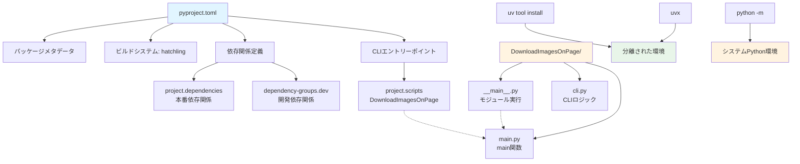
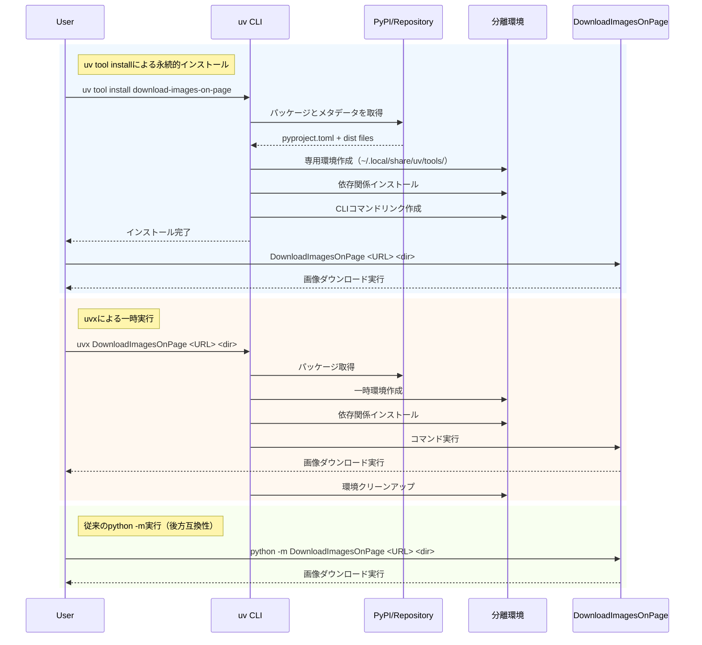
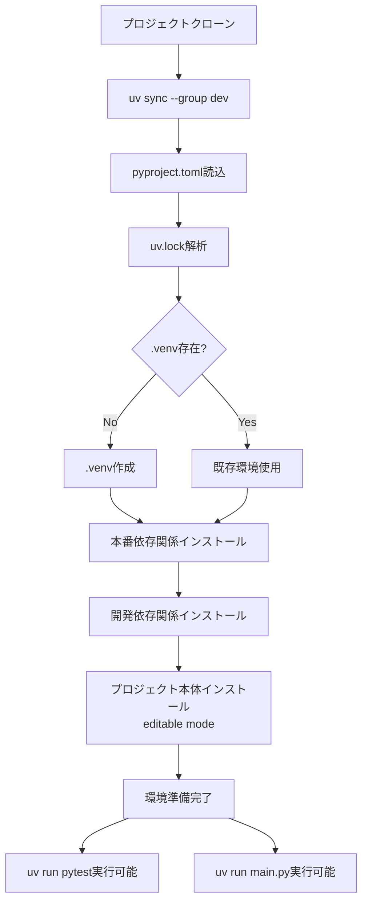

# Design Document: uv Package Migration

## Overview

この機能は、Image DownloaderプロジェクトをPython標準のrequirements.txt管理からuvパッケージマネージャーに移行します。

**Purpose**: `uv tool install`や`uvx`を使用したツールのインストールと実行を可能にし、開発依存関係と本番依存関係を明確に分離し、モダンなPythonパッケージングのベストプラクティスに準拠します。

**Users**: 
- エンドユーザー: uvxで一時的に実行、または`uv tool install`でグローバルインストール
- 開発者: `uv sync --group dev`で開発環境をセットアップ
- パッケージメンテナー: PyPI公開やプライベートリポジトリへの配布

**Impact**: 既存の`python -m DownloadImagesOnPage`実行方法は維持され、新たにuvエコシステムとの統合が追加されます。

### Goals
- pyproject.tomlを作成し、uvパッケージ標準に準拠
- CLIエントリーポイント`DownloadImagesOnPage`を定義し、`uv tool install`と`uvx`で実行可能に
- 開発依存関係を`[dependency-groups.dev]`で分離
- 後方互換性を維持（`python -m DownloadImagesOnPage`が引き続き動作）
- README.mdをuv対応ワークフローに更新

### Non-Goals
- パッケージのリファクタリングや機能変更
- 既存のCLI機能やオプションの変更
- 他のパッケージマネージャー（poetry, pipenv）への対応
- PyPIへの実際の公開（構成のみ準備）

## Architecture

### Existing Architecture Analysis

**現在の構成**:
- パッケージ構造: `DownloadImagesOnPage/` モジュール（`__init__.py`, `__main__.py`, `cli.py`, `main.py`等）
- 依存関係管理: `requirements.txt`（本番・開発依存関係が混在）
- 実行方法: `python -m DownloadImagesOnPage <args>`
- テスト: `pytest`で実行、`tests/`ディレクトリに配置
- ライセンス: MIT（LICENSE file、著者: Ken Sakakibara）

**統合ポイント**:
- 既存のモジュール構造（`DownloadImagesOnPage/`）は保持
- `__main__.py`のエントリーポイントは維持（後方互換性）
- `main.py`の`main()`関数を新規CLIエントリーポイントとして再利用

### Architecture Pattern & Boundary Map



**Architecture Integration**:
- **Selected pattern**: シンプルなモノリシックパッケージ（単一pyproject.toml）
- **Domain/feature boundaries**: 
  - パッケージングレイヤー: pyproject.toml定義
  - アプリケーションレイヤー: 既存のDownloadImagesOnPageモジュール
  - CLIインターフェース: `[project.scripts]`エントリーポイント + `__main__.py`
- **Existing patterns preserved**: 
  - モジュール構造（`DownloadImagesOnPage/__init__.py`、`__main__.py`）
  - テストディレクトリ構造（`tests/`）
  - CLI実装パターン（argparse使用）
- **New components rationale**: 
  - pyproject.toml: Python標準パッケージング設定（PEP 517/518/621）
  - uv.lock: 再現可能な環境のための依存関係ロック
  - [dependency-groups.dev]: 開発依存関係の明確な分離（PEP 735）
- **Steering compliance**: モダンなPython標準に準拠、既存コード変更を最小化

### Technology Stack

| Layer | Choice / Version | Role in Feature | Notes |
|-------|------------------|-----------------|-------|
| Package Manager | uv 0.6.12+ | 依存関係管理、ビルド、パッケージング | Rust製、高速、all-in-one solution |
| Build Backend | hatchling | パッケージビルド | モダン、設定最小限、PEP 517/660準拠 |
| Config Format | pyproject.toml (PEP 621) | プロジェクトメタデータと依存関係 | Python標準 |
| Runtime Dependencies | requests>=2.31.0, beautifulsoup4>=4.12.0, lxml>=5.0.0, Pillow>=10.0.0 | 既存機能の維持 | バージョン制約は現状維持 |
| Dev Dependencies | pytest>=7.4.0, pytest-cov>=4.1.0, pytest-mock>=3.12.0 | テスト実行 | `[dependency-groups.dev]`に分離 |

## System Flows

### パッケージインストールと実行フロー



**フロー決定事項**:
- uv tool installは分離環境を作成し、他のツールと依存関係が競合しない
- uvxは実行後に一時環境を自動クリーンアップ
- 従来のpython -m実行は`__main__.py`経由で継続サポート

### 開発環境セットアップフロー



## Requirements Traceability

| Requirement | Summary | Components | Interfaces | Flows |
|-------------|---------|------------|------------|-------|
| 1.1, 1.2, 1.3, 1.4 | uvパッケージ構成への移行 | pyproject.toml, ビルドシステム設定 | PEP 621メタデータ, [build-system] | - |
| 1.5 | requirements.txt削除 | requirements.txt → pyproject.toml移行 | - | - |
| 2.1, 2.2, 2.3, 2.4 | 依存関係の分離 | pyproject.toml依存関係セクション | [project.dependencies], [dependency-groups.dev] | - |
| 3.1, 3.2, 3.3, 3.4 | uvツールインストール対応 | CLIエントリーポイント, パッケージメタデータ | [project.scripts] | uv tool install → 分離環境 |
| 4.1, 4.2, 4.3, 4.4 | uvx実行対応 | パッケージ名, CLIエントリーポイント | [project.scripts], [project.name] | uvx → 一時環境 → クリーンアップ |
| 5.1, 5.2, 5.3, 5.4, 5.5, 5.6 | ドキュメント更新 | README.md | - | - |
| 6.1, 6.2, 6.3, 6.4, 6.5, 6.6, 6.7 | パッケージメタデータ完全性 | pyproject.toml [project]セクション | name, version, description, authors, license, readme, classifiers | - |
| 7.1, 7.2, 7.3, 7.4 | 後方互換性維持 | __main__.py, モジュール構造 | - | python -m DownloadImagesOnPage |

## Components and Interfaces

### Component Summary

| Component | Domain/Layer | Intent | Req Coverage | Key Dependencies (P0/P1) | Contracts |
|-----------|--------------|--------|--------------|--------------------------|-----------|
| pyproject.toml | Configuration | パッケージメタデータ、依存関係、ビルド設定を定義 | 1.1-1.5, 2.1-2.4, 3.1, 4.4, 6.1-6.7 | hatchling (P0), Python>=3.11 (P0) | Project Metadata |
| [project.scripts] | CLI Interface | CLIエントリーポイント定義 | 3.2, 4.1 | main.py:main (P0) | CLI Entry Point |
| [dependency-groups.dev] | Dependency Management | 開発依存関係の分離 | 2.2, 2.4 | pytest, pytest-cov, pytest-mock (P1) | Dependency Group |
| README.md | Documentation | ユーザー向け使用方法とセットアップ手順 | 5.1-5.6 | - | Documentation |
| __main__.py | Backward Compatibility | モジュール実行のエントリーポイント | 7.1-7.4 | main.py (P0) | Module Entry Point |

### Configuration Layer

#### pyproject.toml

| Field | Detail |
|-------|--------|
| Intent | Python標準パッケージ設定ファイル、全てのメタデータと依存関係を一元管理 |
| Requirements | 1.1, 1.2, 1.3, 1.4, 1.5, 2.1, 2.2, 2.3, 6.1, 6.2, 6.3, 6.4, 6.5, 6.6, 6.7 |

**Responsibilities & Constraints**
- パッケージメタデータの定義（name, version, description, authors, license）
- 依存関係の宣言（runtime, development）
- ビルドシステムの指定（hatchling）
- CLIエントリーポイントの定義
- Python最小バージョン要件（>=3.11）

**Dependencies**
- External: hatchling (ビルドバックエンド) — パッケージビルド (P0)
- External: Python>=3.11 — ランタイム要件 (P0)

**Contracts**: Project Metadata [X]

##### Project Metadata Contract

```toml
[project]
name = "download-images-on-page"
version = "0.1.0"
description = "Download all images from a specified web page"
readme = "README.md"
requires-python = ">=3.11"
license = { text = "MIT" }
authors = [
    { name = "Ken Sakakibara" }
]
classifiers = [
    "Development Status :: 4 - Beta",
    "Intended Audience :: Developers",
    "Intended Audience :: End Users/Desktop",
    "License :: OSI Approved :: MIT License",
    "Programming Language :: Python :: 3",
    "Programming Language :: Python :: 3.11",
    "Programming Language :: Python :: 3.12",
    "Programming Language :: Python :: 3.13",
    "Topic :: Internet :: WWW/HTTP",
    "Topic :: Utilities",
]
dependencies = [
    "requests>=2.31.0",
    "beautifulsoup4>=4.12.0",
    "lxml>=5.0.0",
    "Pillow>=10.0.0",
]

[dependency-groups]
dev = [
    "pytest>=7.4.0",
    "pytest-cov>=4.1.0",
    "pytest-mock>=3.12.0",
]

[project.scripts]
DownloadImagesOnPage = "DownloadImagesOnPage.main:main"

[build-system]
requires = ["hatchling"]
build-backend = "hatchling.build"
```

**Implementation Notes**
- **Integration**: PEP 621準拠の標準フォーマット
- **Validation**: 
  - package name: PyPI命名規則（lowercase-hyphen）
  - version: セマンティックバージョニング（SemVer）
  - classifiers: PyPI トローブ分類子を使用
- **Risks**: 
  - ビルドバックエンド変更が必要な場合、`[build-system]`のみ更新
  - CLIエントリーポイントのモジュールパスが正確でない場合、`uv tool install`失敗

### CLI Interface Layer

#### [project.scripts] Entry Point

| Field | Detail |
|-------|--------|
| Intent | CLIコマンド名とPython関数のマッピングを定義 |
| Requirements | 3.2, 4.1 |

**Responsibilities & Constraints**
- `DownloadImagesOnPage`コマンドを`DownloadImagesOnPage.main:main`関数にマッピング
- `uv tool install`実行時にシステムPATHに追加
- `uvx`実行時に一時環境でアクセス可能に

**Dependencies**
- Inbound: uv CLI — コマンド実行 (P0)
- Outbound: DownloadImagesOnPage.main.main() — アプリケーションロジック (P0)

**Contracts**: CLI Entry Point [X]

##### CLI Entry Point Contract

```toml
[project.scripts]
DownloadImagesOnPage = "DownloadImagesOnPage.main:main"
```

- **Entry Point Format**: `command-name = "module.path:function"`
- **Command Name**: `DownloadImagesOnPage` （ユーザー要件に従う）
- **Module Path**: `DownloadImagesOnPage.main` （既存モジュール構造）
- **Function**: `main()` （既存のmain関数を再利用）

**Implementation Notes**
- **Integration**: 既存の`DownloadImagesOnPage/main.py`の`main()`関数を変更せずに使用
- **Validation**: 
  - `uv tool install`後に`which DownloadImagesOnPage`で確認
  - `uvx DownloadImagesOnPage --help`でヘルプ表示確認
- **Risks**: モジュールパスが誤っていると`ModuleNotFoundError`

### Dependency Management Layer

#### [dependency-groups.dev]

| Field | Detail |
|-------|--------|
| Intent | 開発専用の依存関係を本番依存関係から分離 |
| Requirements | 2.2, 2.4 |

**Responsibilities & Constraints**
- 開発・テスト用ツール（pytest, pytest-cov, pytest-mock）を定義
- `uv sync --group dev`で明示的にインストール
- 本番環境では不要（`uv sync`のみで除外）

**Dependencies**
- External: pytest>=7.4.0 — テストフレームワーク (P1)
- External: pytest-cov>=4.1.0 — カバレッジ計測 (P1)
- External: pytest-mock>=3.12.0 — モックサポート (P1)

**Contracts**: Dependency Group [X]

##### Dependency Group Contract

```toml
[dependency-groups]
dev = [
    "pytest>=7.4.0",
    "pytest-cov>=4.1.0",
    "pytest-mock>=3.12.0",
]
```

**Implementation Notes**
- **Integration**: 
  - 開発セットアップ: `uv sync --group dev`
  - 本番セットアップ: `uv sync` （devグループ除外）
- **Validation**: 
  - `uv run pytest`でテスト実行可能か確認
  - `uv pip list`で開発依存関係の有無確認
- **Risks**: グループ名の誤りや依存関係の欠落でテスト失敗

### Backward Compatibility Layer

#### DownloadImagesOnPage/__main__.py

| Field | Detail |
|-------|--------|
| Intent | `python -m DownloadImagesOnPage`実行をサポート |
| Requirements | 7.1, 7.2, 7.3, 7.4 |

**Responsibilities & Constraints**
- モジュールとして実行された際のエントリーポイント
- 既存の`main.main()`を呼び出す
- 変更不要（既存コード保持）

**Dependencies**
- Outbound: DownloadImagesOnPage.main.main() — アプリケーションロジック (P0)

**Contracts**: Module Entry Point [X]

##### Module Entry Point Contract

```python
# DownloadImagesOnPage/__main__.py (変更なし)
"""Entry point for running as a module: python -m DownloadImagesOnPage"""
import sys
from .main import main

if __name__ == "__main__":
    sys.exit(main())
```

**Implementation Notes**
- **Integration**: 既存コード保持、変更不要
- **Validation**: 
  - `python -m DownloadImagesOnPage --help`で動作確認
  - 既存テストスイートを実行してパス確認
- **Risks**: なし（変更を加えないため）

### Documentation Layer

#### README.md

| Field | Detail |
|-------|--------|
| Intent | uv対応の使用方法とセットアップ手順を提供 |
| Requirements | 5.1, 5.2, 5.3, 5.4, 5.5, 5.6 |

**Responsibilities & Constraints**
- uvを使用したインストール方法（`uv tool install`）
- uvxを使用した一時実行方法
- 開発環境セットアップ（`uv sync --group dev`）
- 従来のvenv + pip方式はレガシーセクションに移動または削除
- Python 3.11+の必須要件とuvのインストール方法へのリンク

**Dependencies**
- None (静的ドキュメント)

**Contracts**: Documentation [X]

**Implementation Notes**
- **Structure**: 
  1. プロジェクト概要
  2. 必要要件（Python 3.11+, uv）
  3. インストール方法（3パターン: uv tool install, uvx, 開発環境）
  4. 使用方法とオプション
  5. テスト実行
  6. トラブルシューティング
  7. ライセンス
- **Examples**: 
  - `uv tool install download-images-on-page`
  - `uvx DownloadImagesOnPage https://example.com ./images`
  - `uv sync --group dev && uv run pytest`
- **Risks**: ドキュメントの更新漏れでユーザー混乱

## Data Models

本機能はパッケージング設定の変更であり、ランタイムデータモデルの変更はありません。既存のアプリケーションデータモデル（画像情報、フィルター条件等）は保持されます。

### Configuration Model

**pyproject.toml構造**:
- `[project]`: パッケージメタデータ（name, version, description, authors, license, readme, requires-python, dependencies）
- `[dependency-groups]`: 依存関係グループ（dev）
- `[project.scripts]`: CLIエントリーポイント
- `[build-system]`: ビルドバックエンド設定

## Error Handling

### Error Strategy

パッケージング段階でのエラーハンドリング:
- **ビルドエラー**: pyproject.toml構文エラーや不正なメタデータ → ビルド失敗、明確なエラーメッセージ
- **依存関係解決エラー**: 互換性のないバージョン制約 → uv lockfile作成失敗
- **CLI実行エラー**: エントリーポイント不正 → ImportError/ModuleNotFoundError

### Error Categories and Responses

**Configuration Errors** (ビルド時):
- pyproject.toml構文エラー → TOML解析エラーメッセージ、行番号表示
- 不正なメタデータ → バリデーションエラー、必須フィールド指摘
- ビルドバックエンド不在 → 依存関係インストール失敗

**Dependency Errors** (インストール時):
- バージョン競合 → `uv lock`失敗、競合する依存関係を表示
- パッケージ不在 → PyPIから取得失敗、代替パッケージ提案なし（手動修正必要）

**Runtime Errors** (CLI実行時):
- エントリーポイント不正 → `ModuleNotFoundError` または `AttributeError`
- 既存のアプリケーションエラー → 変更なし（既存エラーハンドリング維持）

### Monitoring

- **ビルド検証**: `uv build`で dist/ 生成確認
- **インストール検証**: `uv tool install --force .`でローカルインストール
- **実行検証**: `DownloadImagesOnPage --help`でヘルプ表示確認
- **テスト検証**: `uv run pytest`で全テストパス確認

## Testing Strategy

### Unit Tests
- pyproject.tomlメタデータ検証（name, version, authors等が正しく設定されているか）
- 依存関係リスト検証（requirements.txtと同一の依存関係が含まれるか）
- ビルドシステム設定検証（hatchlingが正しく指定されているか）

### Integration Tests
- `uv tool install`によるインストール成功
- インストール後の`DownloadImagesOnPage --help`実行
- `uvx DownloadImagesOnPage --help`による一時実行
- `python -m DownloadImagesOnPage --help`による後方互換性確認

### E2E Tests
- `uv tool install`実行 → 画像ダウンロード（実際のURL使用） → 成功確認
- `uvx DownloadImagesOnPage <URL> <dir>`実行 → 画像保存確認
- `uv sync --group dev`実行 → `uv run pytest`で既存テストスイート全パス

### Build/Package Tests
- `uv build`でwheel + sdist生成
- 生成されたdist/ファイルの構造検証（METADATA, entry_points.txt確認）
- `uv pip install dist/*.whl`でインストール → 実行確認

## Migration Strategy

### Phase 1: pyproject.toml作成（破壊的変更なし）
1. pyproject.tomlを作成（全メタデータ、依存関係、ビルドシステム定義）
2. `uv sync --group dev`で環境作成
3. `uv run pytest`で既存テストスイート実行 → 全パス確認
4. `python -m DownloadImagesOnPage --help`で後方互換性確認

**Validation**: 既存機能が一切変更されていないことを確認

### Phase 2: ローカルインストール検証
1. `uv build`でパッケージビルド
2. `uv tool install --force .`でローカルインストール
3. `DownloadImagesOnPage --help`でCLI動作確認
4. 実際のURL使用して画像ダウンロードテスト

**Validation**: CLIエントリーポイントが正常に機能することを確認

### Phase 3: README.md更新
1. uv対応のインストール・使用方法を記載
2. 従来のvenv + pip方式をレガシーセクションに移動
3. トラブルシューティングセクション更新

**Validation**: ドキュメントの正確性をレビュー

### Phase 4: requirements.txt削除または非推奨化
1. requirements.txtを削除、または非推奨コメント追加
2. CIパイプラインをuvベースに更新（該当する場合）

**Rollback Trigger**: 
- Phase 1: 既存テストが失敗した場合 → pyproject.toml削除
- Phase 2: CLIエントリーポイントが機能しない場合 → pyproject.tomlのentry_points修正
- Phase 3-4: ユーザーからのフィードバックで混乱が見られた場合 → ドキュメント修正

## Optional Sections

### Security Considerations

本機能はパッケージング設定の変更であり、新規のセキュリティリスクは導入されません。既存のアプリケーションセキュリティ（HTTP通信、ファイル保存）は変更なしで維持されます。

**依存関係管理**:
- uv.lockで依存関係の正確なバージョンを記録（supply chain攻撃のリスク軽減）
- PyPIからの依存関係取得（信頼されたソース）

### Performance & Scalability

**ビルド性能**:
- hatchlingは軽量かつ高速なビルドバックエンド
- ビルド時間: 数秒以内（小規模プロジェクト）

**インストール性能**:
- uvはRust製で高速な依存関係解決
- 従来のpipと比較して10-100倍高速

**ランタイム性能**:
- 変更なし（既存アプリケーションロジックに影響なし）
